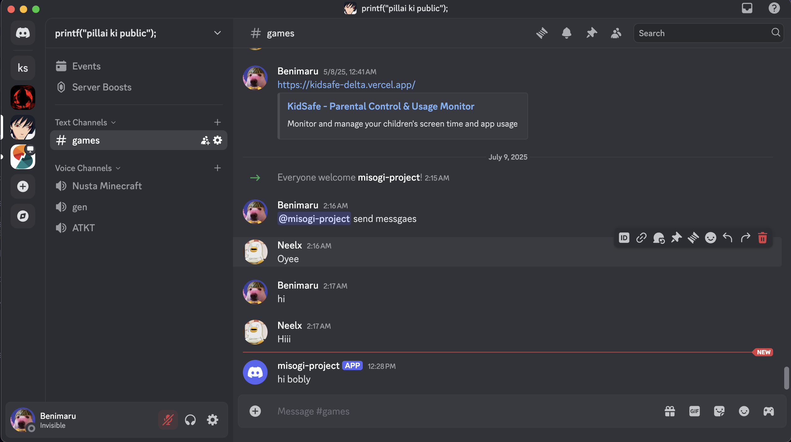
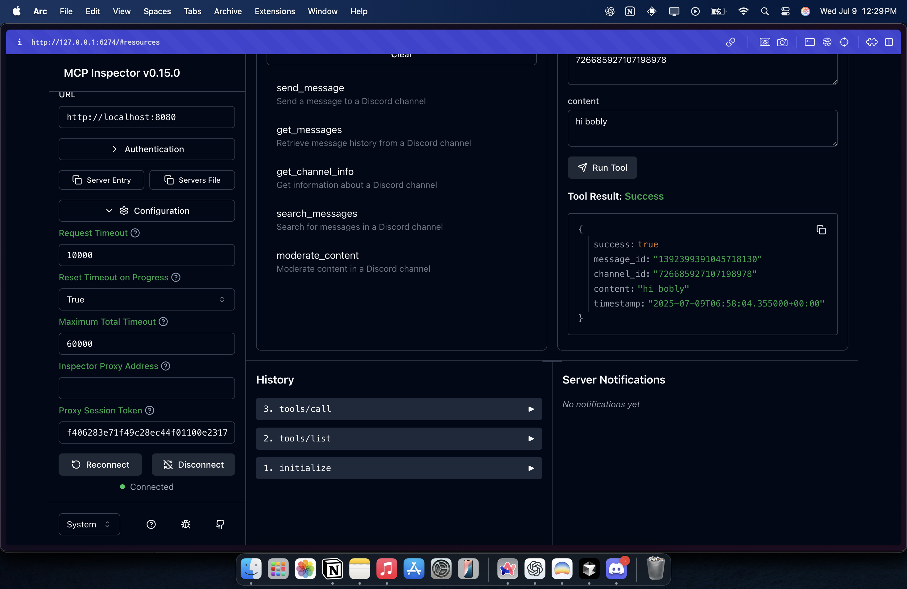

# Discord MCP Server

A Model Context Protocol (MCP) server for Discord integration with support for the MCP Inspector.

## Features

- Discord bot integration with message sending, reading, and moderation
- Session token authentication for MCP Inspector compatibility
- CORS support for web-based MCP clients
- OAuth metadata endpoints for Inspector integration
- Comprehensive audit logging
- Flexible authentication options

## Quick Setup

1. Install dependencies:
```bash
pip install -r requirements.txt
```
2. Run this 
```bash
export DANGEROUSLY_OMIT_AUTH=true
export DISCORD_BOT_TOKEN= ( add your discord bot token with the while creating the bot give it the required access to do so )
python3 main.py
```
3.Run this to start the MCP Inspector in ur local to test it out 
```bash
npx @modelcontextprotocol/inspector
```

Now you can test out your bot using different tools and see its responses 
below are some of my screenshots attached of the result 




